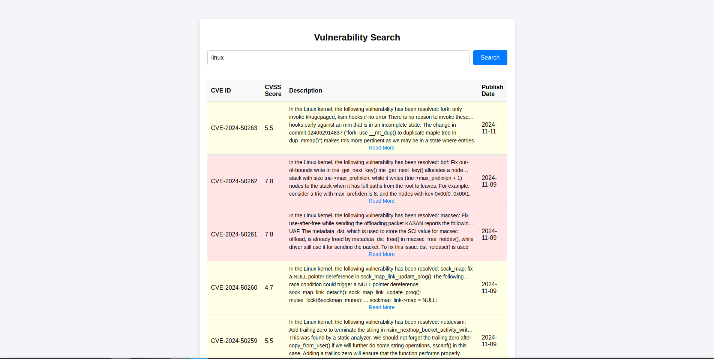

# CVE Scraper and Viewer

This project is a Python and React-based application designed to provide users with an easy way to search for CVEs (Common Vulnerabilities and Exposures) based on their input. It scrapes data from CVE Details, processes it, and displays the results on a user-friendly React frontend.

## Features

1. **User Input:**  
   Users can search for CVEs by entering keywords (e.g., "Linux").

2. **Data Scraping:**  
   The backend scrapes the latest 10 CVEs related to the search term from CVE Details. The data includes:

   - CVE Number
   - A brief description

3. **Frontend Rendering:**  
   Results are displayed on a React-based frontend for an intuitive user experience.

4. **Filtering:**  
   Users can filter the displayed results based on the CVE score.

## Checkpoints

- [x] **Define project structure**  
       Set up the project directory for the backend and frontend.

- [x] **Backend setup**  
       Install necessary libraries and create a basic Python server.

- [x] **User input handling**  
       Implement backend logic to accept and process user input.

- [x] **Data scraping**  
       Develop a Python script to scrape CVE Details based on the user input.

- [x] **API integration**  
       Expose scraped data through a REST API for the frontend to consume.

- [x] **Frontend setup**  
       Initialize a React application and design the UI for user input and results.

- [x] **Render CVE results**  
       Display the latest 10 CVEs fetched from the backend on the React frontend.

- [x] **Filtering feature**  
       Add a filtering mechanism on the frontend to narrow down results based on CVE scores.

## Technology Stack

- **Backend:** Python
- **Frontend:** React.js
  Complete the `README.md

## Installation and Setup

### Prerequisites

1. Python installed on your system.
2. Node.js and npm installed for React.
3. A code editor (e.g., VSCode) is recommended.

### Backend Setup

1. Clone the repository:

   ```bash
   git clone https://github.com/BhattJayD/VulnScrape.git
   cd VulnScrape/backend
   ```

2. Install dependencies:

   ```bash
   pip install -r requirements.txt
   ```

3. Run the backend server:
   ```bash
   python app.py
   ```

### Frontend Setup

1. Navigate to the frontend directory:

   ```bash
   cd VulnScrape/frontend
   ```

2. Install dependencies:

   ```bash
   npm install
   ```

3. Run the React app:
   ```bash
   npm start
   ```

## How to Use

1. Start both the backend and frontend servers.
2. Open the React app in your browser at `http://localhost:3000`.
3. Enter a search term (e.g., "Linux") in the input box and click "Search."
4. View the latest CVEs along with their descriptions and CVE numbers.
5. Use the filter to narrow down results based on the CVE score.

## Future Enhancements

- Add advanced filtering options.
- Implement pagination for more CVE results.
- Provide direct links to detailed CVE information.

## UI Screenshots

### 1. Initial Screen

This is the initial screen of the application with an empty search box and no results displayed.


### 2. Searched Results

Once a query is entered and results are fetched from the backend, the table populates with the CVE details.



### 3. Filter by CVE Score

The table can be filtered based on the CVE score, allowing users to view results with a specific score range.


## Contributing

Contributions are welcome! Feel free to submit a pull request or open an issue for discussion.

## License

This project is licensed under the MIT License.

## Acknowledgments

- CVE Details for providing a valuable database for vulnerabilities.
- The open-source community for support and inspiration.

Now you can check off each checkpoint as you complete it!
